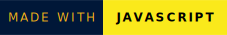
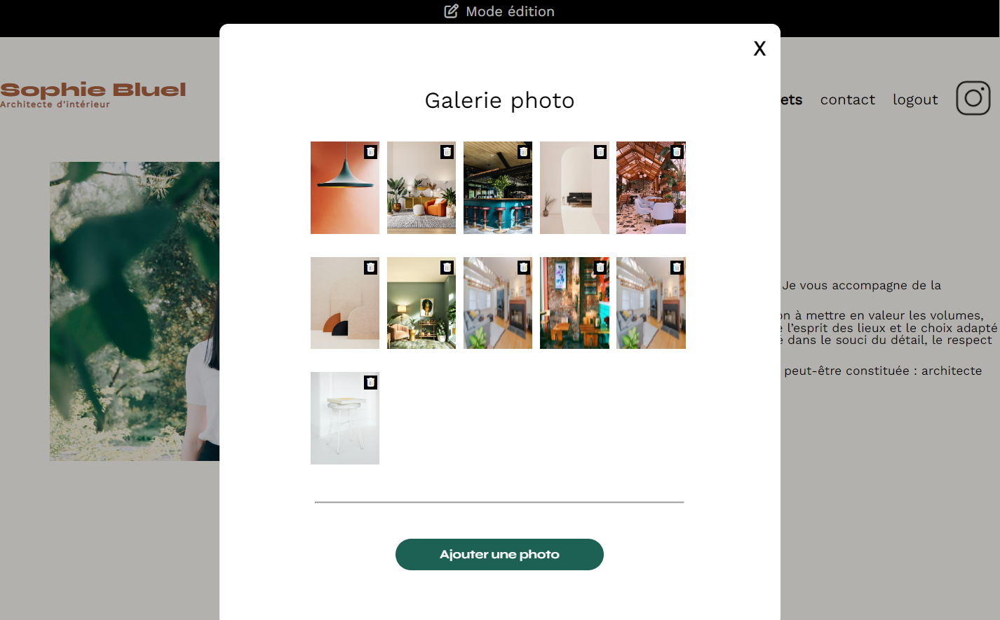
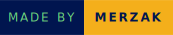

     


# Sophie Bluel 

Sophie Bluel is a portfolio website of an interior architect.
The backend was already coded; I developed the frontend in HTML, CSS, and JAVASCRIPT.

## Screenshots



## Installation

To install and run this project locally on your machine, follow these simple steps:

1. Make sure you have Node.js installed on your machine. If not, you can download and install it from [the official Node.js website](https://nodejs.org/).

2. Clone this GitHub repository to your local machine using the following command:

    ```
    git clone https://github.com/Merzakb/P6-sophie-bluel
    ```

3. Install the necessary dependencies :

### Frontend application
Run the following commands:

```bash
# Navigate to the frontend directory
cd Frontend
```

```bash
# Install dependencies
npm install
```

```bash
# Start local dev server
npm run dev
``` 
If "npm run dev" doesn't work, try opening the index.html file with a browser (Chrome, Firefox...).

### Backend server
Run the following commands:

```bash
# Navigate to the server directory
cd Backend
``` 
```bash
# Install dependencies
npm install
``` 
```bash
# Start local dev server
npm start
``` 
Test account for Sophie Bluel: 
```
email: sophie.bluel@test.tld

password: S0phie 
```

## Technologies :

   

## Authors

- [@Merzak](https://github.com/Merzakb)




## 🔗 Links
[](https://merzak-portfolio.vercel.app/)
[](https://www.linkedin.com/in/merzak-b-0300b9289/)
[](https://twitter.com/__merzak)
